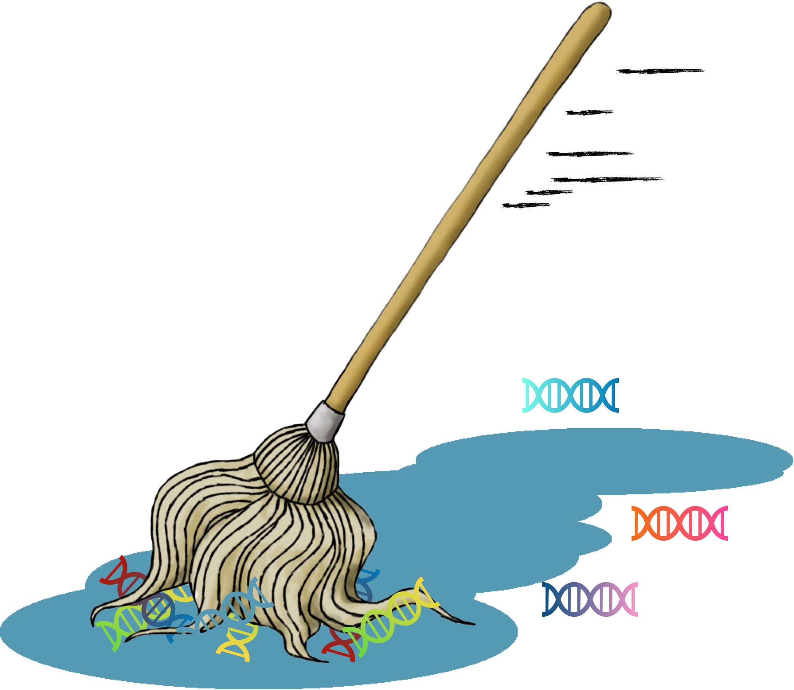

# mop  <a href='https://github.com/RILAB/mop'></a>

Simple tool for capturing alignment regions with sufficient quality for genotyping.

This script has only been tested on Linux systems.

Requires Python3 with libraries: `argparse`, `numpy` `os`, `re`, `io`, `subprocess`.
Requires fully installed version of `samtools` with the `depth` utility.

Assumes all input bam files in the required bamlist were aligned to the same reference genome.
Using indexed bams is encouraged and required for using `--POSITIONS_STRING` 


## Installation

`pip install mop-bam`

Run the following command to see usage options:

`mop -h`

which returns:

```
usage: mop [-h] [-c] [-s] [--pixy_mode] [-M MEAN_DEPTH_MIN] [-x MAX_DEPTH] [-i MIN_DEPTH] [-m DEPTH_PROPORTION] [-Q MAP_QUALITY] [-q BASE_QUALITY] -b [BAMLIST]
           [-l POSITIONS_FILE] [-R POSITIONS_STRING]

Produces bedfile of genomic locations that did or did not map reads sufficiently well. Bed regions are Written to standard out.

optional arguments:
  -h, --help            show this help message and exit
  -c, --single_sites    Output every base separately instead of joining contiguous regions (ignored with pixy_mode).
  -s, --bad_sites       Switch to return sites which fail thresholds. Default is to return passing sites (ignored with pixy_mode).
  --pixy_mode           Switch to produce output for pixy (reports every site and the number of individuals with passing quality thresholds).
  -M MEAN_DEPTH_MIN, --mean_depth_min MEAN_DEPTH_MIN
                        Minimum mean depth across all individuals.
  -x MAX_DEPTH, --max_depth MAX_DEPTH
                        Maximum number of bases allowed per individual after accounting for low base and mapping quality. This flag should always be used in conjunction with
                        -m (ignored with pixy_mode).
  -i MIN_DEPTH, --min_depth MIN_DEPTH
                        Minimum number of bases required per individual after accounting for low base and mapping quality. This flag should always be used in conjunction with
                        -m.
  -m DEPTH_PROPORTION, --depth_proportion DEPTH_PROPORTION
                        Minimum proportion of individuals with site counts greater than --min_depth that are required for site to pass. Test is applied after accounting for
                        low base and mapping quality.
  -Q MAP_QUALITY, --map_quality MAP_QUALITY
                        Minimim mapping quality.
  -q BASE_QUALITY, --base_quality BASE_QUALITY
                        Minimim base quality.
  -b [BAMLIST], --bamlist [BAMLIST]
                        List of bam files. One per line.
  -l POSITIONS_FILE, --positions_file POSITIONS_FILE
                        Optional file of reference position to pass to "samtools depth".
  -R POSITIONS_STRING, --positions_string POSITIONS_STRING
                        Optional file of reference position to pass to "samtools depth". Requires input bam files to be indexed. Format is chromosome:start-end.
```

